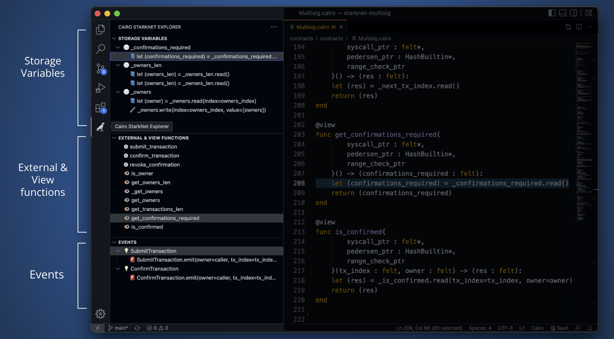

# Cairo StarkNet Explorer extension

This VSCode extension quickly shows relevant aspects of StarkNet contracts:
 - Storage variables of the current contract, and where they are read and written to.
 - External and View functions.
 - Events and where they are emitted.

## How to use
To use the extension, open a StarkNet contract and switch to the Cairo StarkNet Explorer tab on the sidebar.

Then, you will be able to navigate using the different panels:
 - **Storage variables**: shows all storage variables, where they are read and where they are written to
 - **External & View functions**: shows all external and view functions
 - **Events**: shows event declaration and where each even is emitted



Live mode:
- Editing the currently open contracts will automatically update the StarkNet Explorer data.

## Installation


```bash
git clone git@github.com:crytic/vscode-cairo-starknet-explorer.git

cd cairo-starknet-explorer
code --install-extension cairo-starknet-explorer.vsix
```