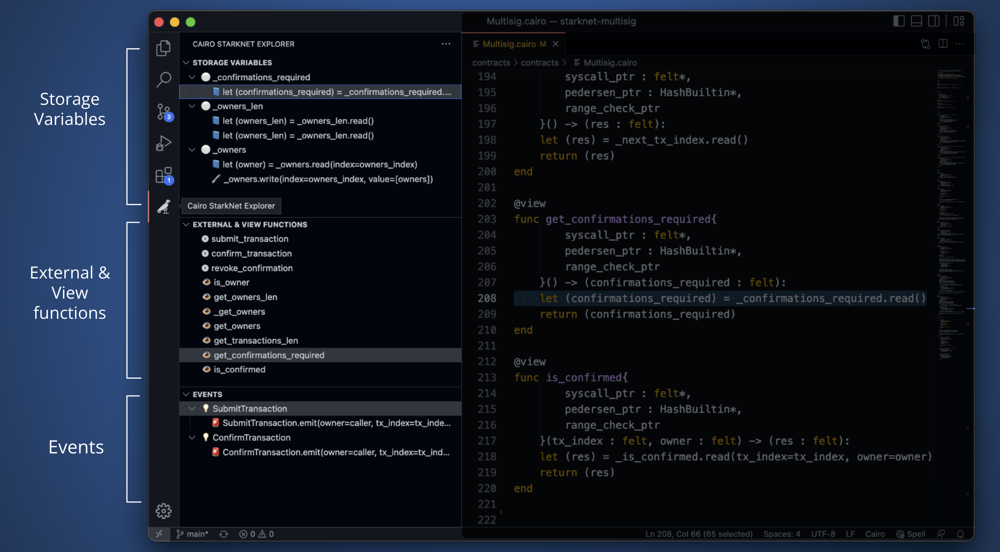

# StarkNet Explorer extension

This VSCode extension quickly shows relevant aspects of StarkNet contracts:
 - Storage variables of the current contract, and where they are read and written to.
 - External and View functions.
 - Events and where they are emitted.
 - Live mode: editing the currently open contracts will update the StarkNet Explorer data.

## How to use
To use the extension, open a StarkNet contract and switch to the StarkNet Explorer tab on the sidebar.

Then, you will be able to navigate using the different panels:
 - **Storage variables**: shows all storage variables, where they are read and where they are written to
 - **External & View functions**: shows all external and view functions
 - **Events**: shows event declaration and where each event is emitted



## Installation

### Marketplace
Install vscode-starknet-explorer from the Visual Studio Marketplace within the Extensions tab of Visual Studio Code.

### From prebuilt package
```bash
git clone git@github.com:crytic/vscode-starknet-explorer.git

cd starknet-explorer
code --install-extension starknet-explorer.vsix
```
### Building from source:
To build, run:
```bash
npx vsce package
```
A file `starknet-explorer-x.y.z.vsix` is created and it needs to be installed.

Use either `code --install-extension starknet-explorer-x.y.z.vsix` or install it directly in VSCode through the `Extensions` tab, under the `...` menu.

